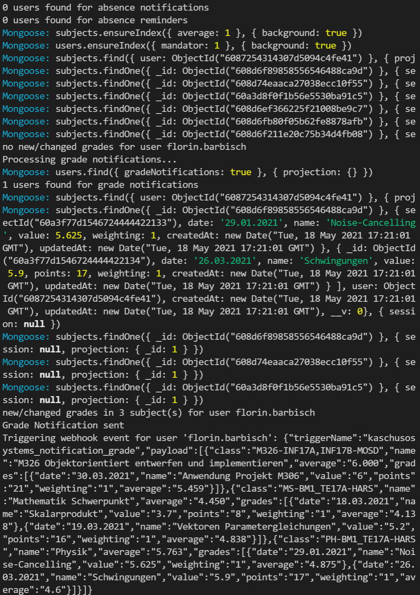
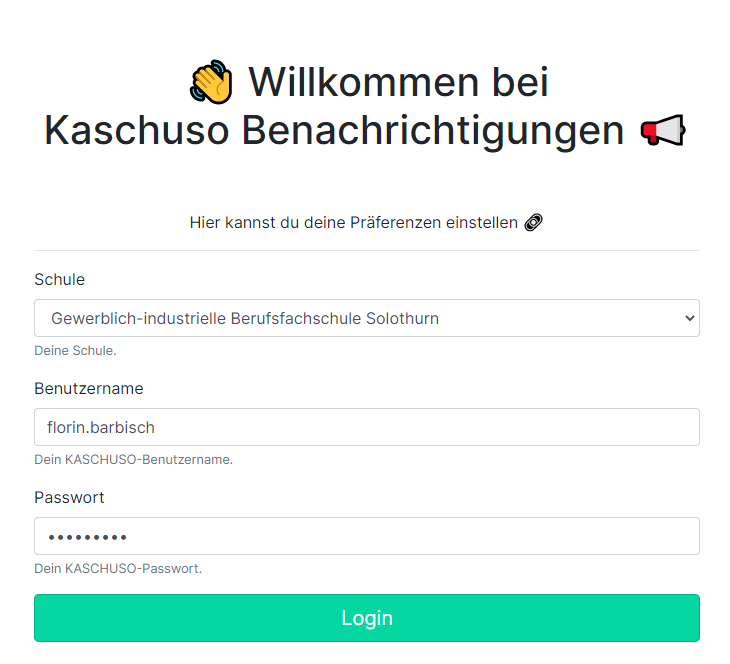
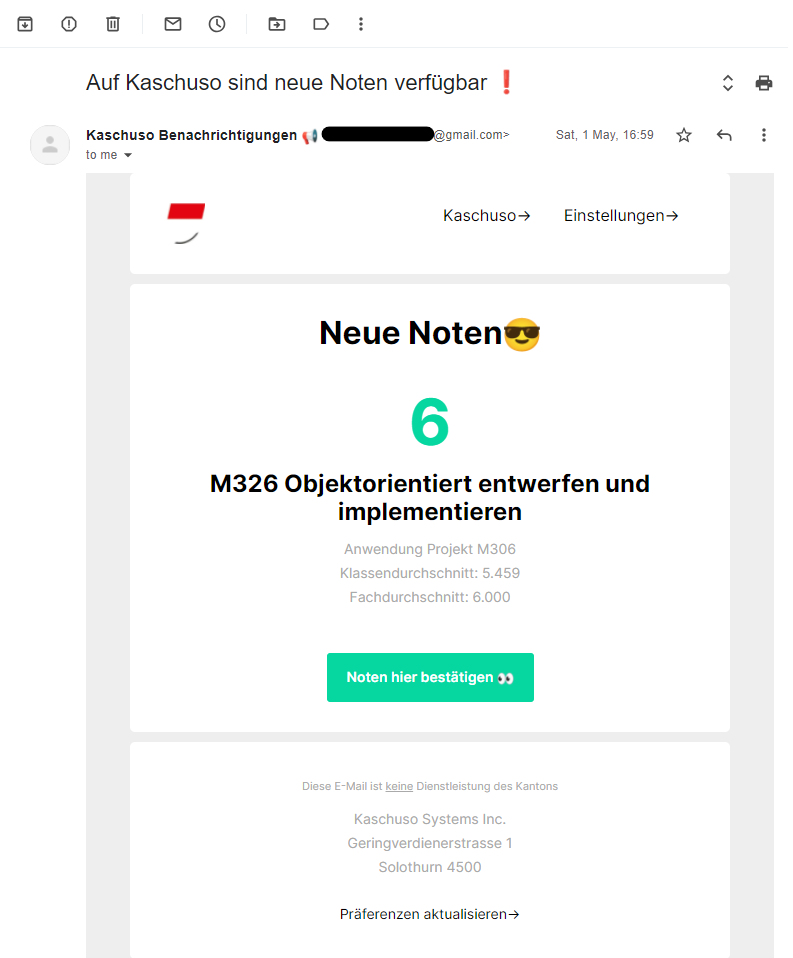
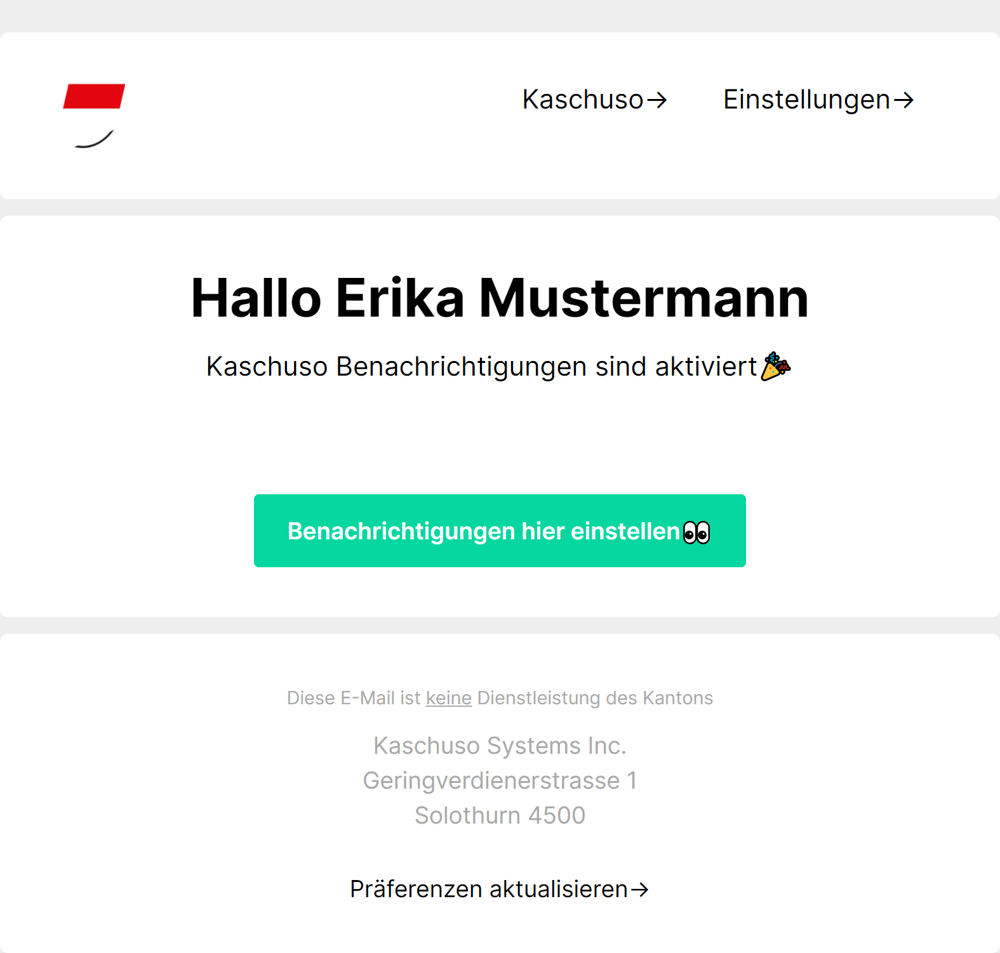
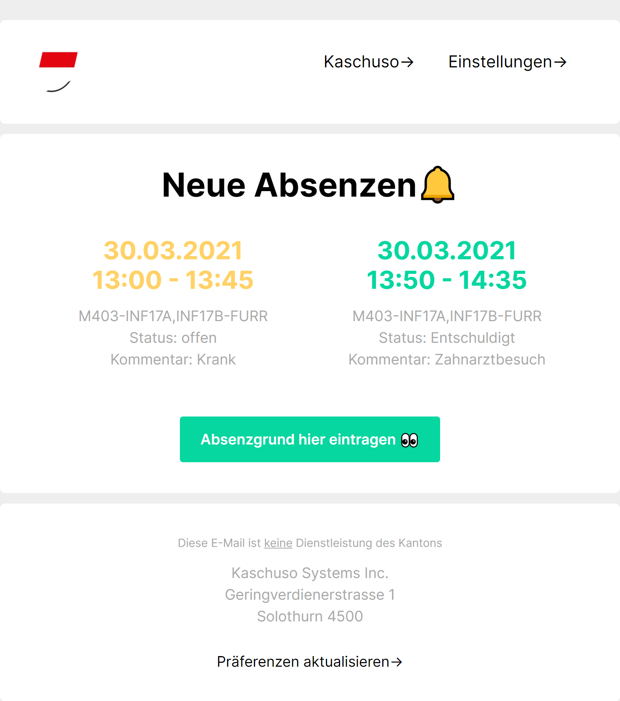
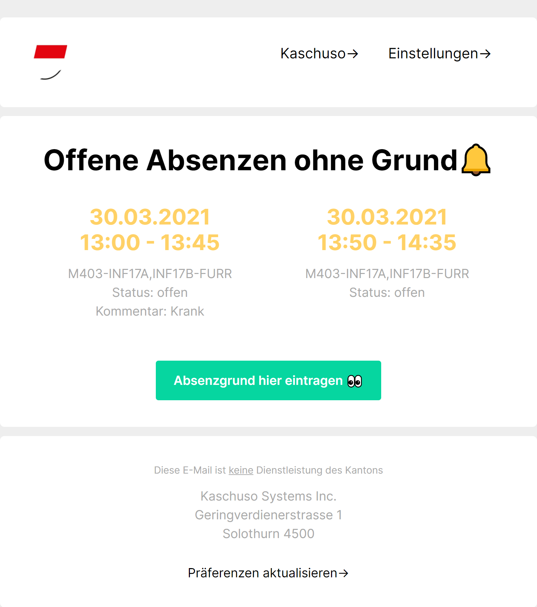

# kebab aka Kaschuso Notifier

Kaschuso Notifier adds a user experience layer on top of kaschuso.so.ch (the cantonal school ERP).
Kaschuso allows the students to see their marks and their absences. With Kaschuso Notifier a student can receive a notification, whenever:
 - a new grade is added
 - a new absence is added

Furthermore, the user can receive a reminder every 24 hours when an absence does not contain a reason.

The user cannot only receive an email but also trigger an IFTTT Applet.

[kaschuso-api](https://github.com/KaschusoSystems/kaschuso-api) is a wrapper for kaschuso.so.ch to make its content available via a Rest API.

# Log

# Login Page

# Settings Page

# Mail

# Welcome Mail

# Grades Mail

# Absences Mail

# Absences Reminder Mail

# Webhook Error Mail

